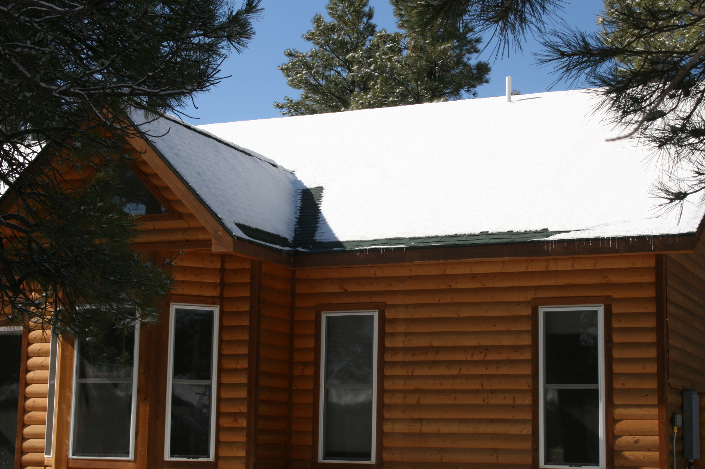
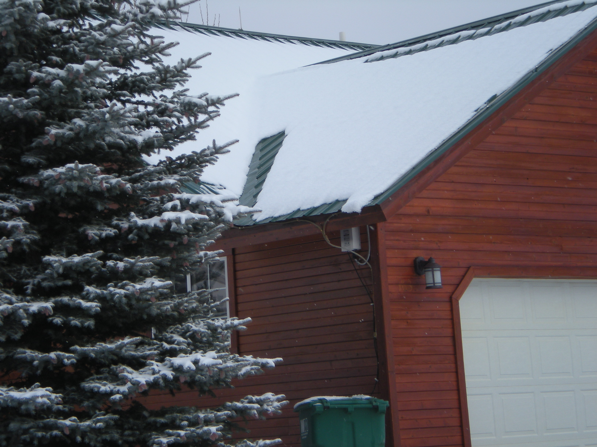
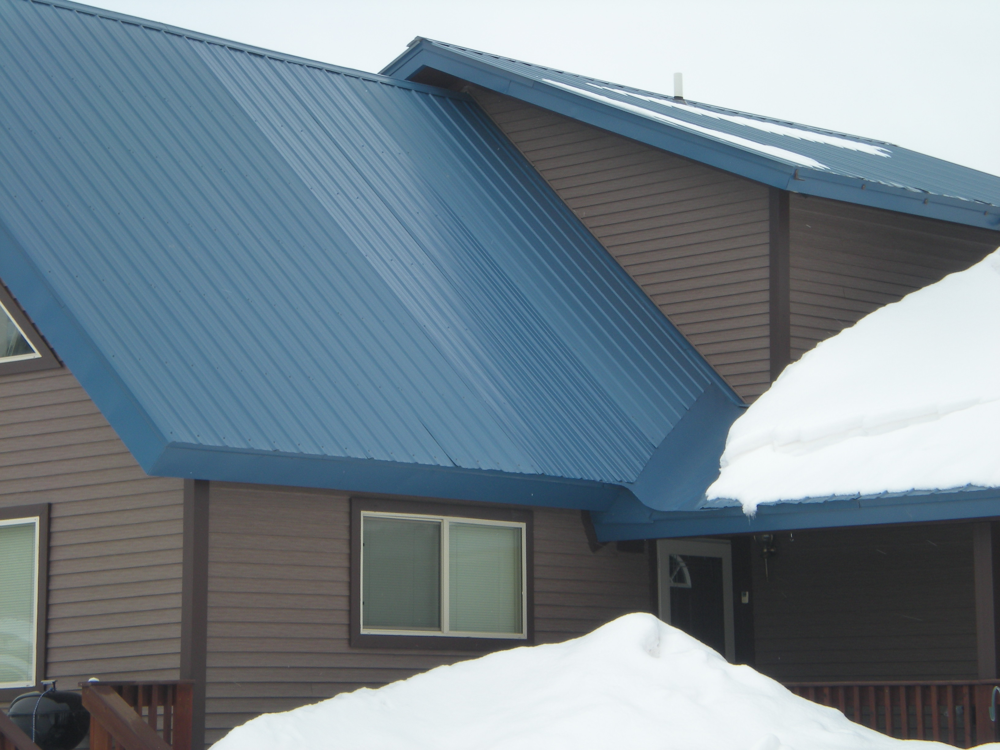
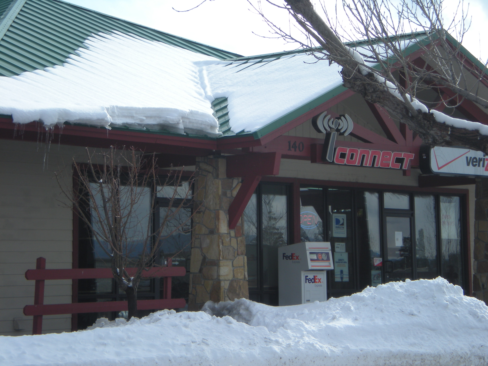

The Bruce Oswald project is one of the broadest roof deicing installs in our portfolio. The work covers four separate buildings on a single property: a main log home, a second log structure, a third building with a metal roof, and a small retail space. Each building has its own roof geometry, its own snow exposure, and its own deicing problem to solve. We treated them as four projects under one roof line, not as one project repeated four times.

*The main log home, mid-storm. Snow stops cleanly at the heated band along the eave; the upper roof carries its load until the temperature breaks.*

## Why multi-section roofs are harder

A simple rectangular roof is straightforward to deice. Run cable along the eave and through the gutters; the meltwater has one path to follow. Done.

A multi-section roof, with gables intersecting, dormers sitting above main roof slopes, and valley details collecting drift, has multiple ice-formation zones, each with its own thermal behavior. Snow accumulates differently on a south-facing dormer than it does on a north-facing valley. A cable layout that handles one well will leave the other vulnerable.

Across the four buildings on the Bruce Oswald property, no two roofs presented the same problem. Each got its own cable run, its own controller logic, and its own moisture sensor placement.

> The mistake on a multi-section roof is treating it as one roof. It's really three or four roofs in close proximity.

## What the install covers

Across the property, the work hits the same four problem zones on every building:

- The main roof eaves, with parallel cable runs on the snow-prone faces
- The dormer-to-main and gable-to-gable transitions, where ice tends to bridge and bond
- The valley details, where drift accumulates fastest and freeze-thaw cycles compound
- The gutter and downspout integration that keeps the meltwater moving

*The second log building, carrying a heavier snow load. Steep evergreen shade and a north exposure mean the cable here runs more often than on the main home.*

The cover image of this post is what we keep coming back to: a side-by-side view showing one section of the roof clear of snow (the heated zone, working as designed) against an adjacent section still covered (the unheated reference area, intentionally left untreated for visual proof).

*A third building on the property with a standing-seam metal roof. Different surface, same approach: cable along the eave, snow stops where the heat begins.*

The fourth structure on the property is small commercial space leased to a handful of retail tenants. The brief was the same as the residences: keep the eaves clear, keep the gutters moving, keep ice off the entryway awnings where customers walk in.

*The retail building. The heated band over the entryway keeps icicles off the doorway, where falling ice is more than a roofing problem.*

## Why a property-wide approach matters

For prospective customers looking at multi-section roofs, the lesson from Bruce Oswald is that the cable, the controller, and the sensor placement all have to be tuned to the specific roof in front of you. Four buildings on one property gave us four different right answers, not one answer applied four times.

For our team, the project is reference material. Multi-section residential roofs and small mixed-use properties are increasingly common as owners build additions, accessory buildings, or commercial space alongside their main residence. Each new project benefits from what we learned at Bruce Oswald.

If your roof has more than two or three planes, or if you have more than one building to protect, expect a segmented deicing approach. The single-cable shortcut won't catch the problem zones the way a properly-segmented system will.
