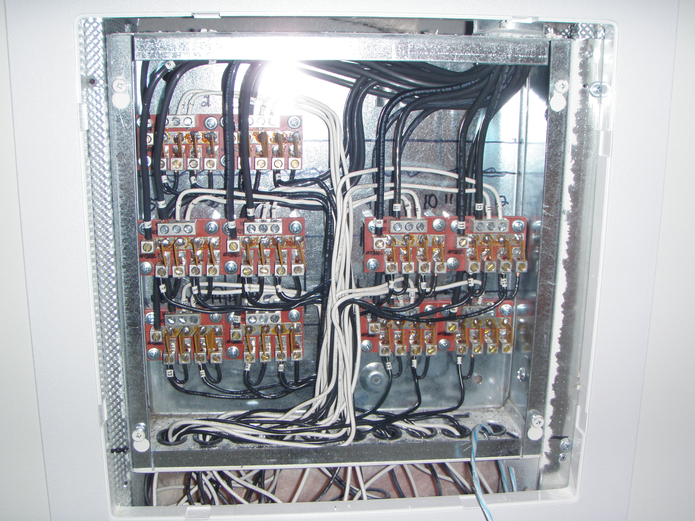
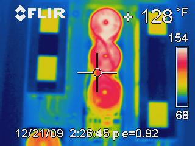
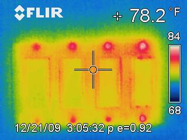
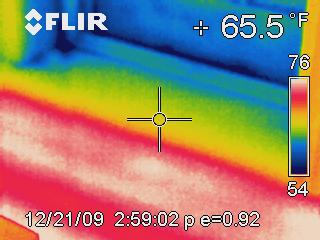
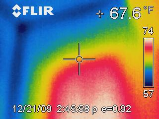

Commercial property buyers are skeptical buyers. They've been pitched on enough systems that didn't deliver, by enough vendors who described their products as "industry-leading" without backing up the claim. By the time you're in front of a facility manager with a snowmelt proposal, you have about three minutes to demonstrate that what you're selling actually works.

This is where the FLIR camera earns its place in the pitch deck.

## What we did at Chase Plaza

After completing the snowmelt installation at Chase Plaza, we returned with a thermal imaging camera on December 21, 2009. The system had been operating for a stretch under genuine winter conditions. We captured a full series of FLIR thermal images across the installation, including control cabinets, transformer stages, element zones, and the heated surface area itself.

The thermal images aren't an internal QA exercise. They're a sales tool. They're proof.

> The customer doesn't have to take our word for it. The thermal camera doesn't have an opinion.

## What the thermal data showed

Across the documented zones, surface temperatures held within the expected operating band. The element pattern read clearly through the surface materials. Hot spots and cold spots that would have indicated installation defects, wiring issues, or undersized zones: none of them appeared. The system was, in the most literal sense, doing what we said it would do.

The proof starts inside the cabinet, before any heat ever leaves the building.

*Inside the Chase Plaza control cabinet: the relay-driven control system that runs the heating zones, captured during the December 2009 documentation visit.*

Each relay drives a zone, and each one shows up on the camera as its own temperature signature. The thermal view is what tells you whether any of those signatures is running outside its expected band.

*One transformer stage at full load. Spotting a high-running component this clearly, in a single frame, is exactly the kind of catch that would require pulling apart the cabinet without the camera.*

*The element power supplies, all running in the same narrow temperature band. Uniformity across a multi-unit bank is the visual signature of a balanced, healthy load.*

From the cabinet, we walked the heated surface and pointed the camera at the floor itself. This is where the system either passes or fails its real audition.

*The element runs reading through the finished surface in evenly-spaced parallel lines. Consistent stripe spacing and consistent stripe brightness are the visual proof that watt density is uniform across the zone.*

*A heated zone meeting an unheated boundary. The sharp edge of the warm region is exactly what the design called for: heat where it's needed, cleanly stopping where it isn't.*

For a commercial buyer evaluating whether to specify snowmelt at their next property, that's the kind of evidence that closes deals.

## Why thermal documentation matters

There are three reasons we now recommend thermal imaging documentation on every commercial snowmelt project:

1. **Commissioning evidence.** It proves the system was operating correctly at handover, in case there's any future dispute about what was delivered.
2. **Warranty baseline.** If a problem develops later, we have a thermal baseline to compare against.
3. **Marketing asset.** With the customer's permission, the thermal images become reference material for prospective buyers in the same market segment.

The marginal cost of capturing the images during commissioning is minimal: a couple of hours of a technician's time with a camera that lives on the truck anyway. The downstream value is significant.

## A note on the dataset

The Chase Plaza imagery, all dated December 21, 2009, has been doing sales work for years now. Every commercial deicing prospect who asks "how do we know it works?" gets pointed at this set. The conversation usually shifts pretty quickly from skepticism to scope.

If you're evaluating a snowmelt system for a commercial property, ask the vendor for thermal documentation from a comparable installation. If they can't produce it, that tells you something. If they can, and the data looks like Chase Plaza's, that tells you something different.
