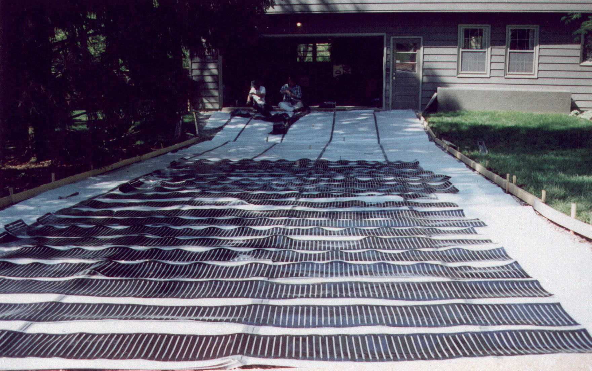
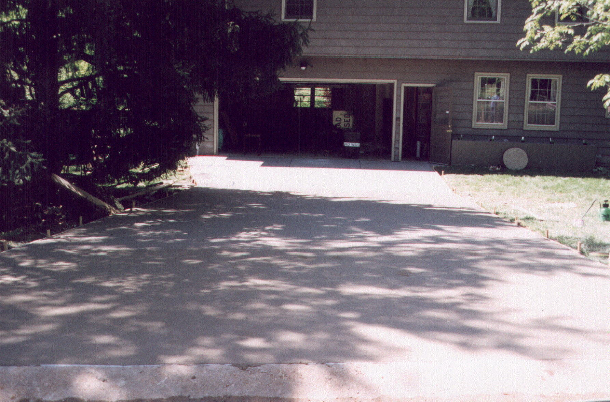
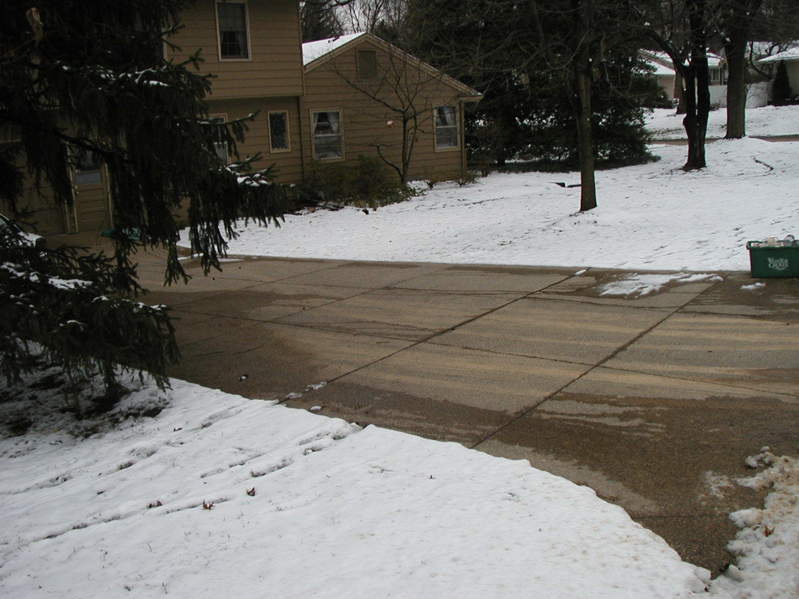

The Duffy project is a residential driveway snowmelt install that the owner photographed methodically: element layout on the prepared base, the concrete pour, the cured surface, and the first storms after commissioning. The reason that's worth dwelling on isn't documentation for its own sake. It's that we can now walk a prospective customer through every stage of what their own driveway would look like, with real photographs of a real driveway in someone else's life.

That's a different sales conversation than a brochure.

## What residential driveway snowmelt actually is

A heated residential driveway isn't a luxury feature in a marketing sense. It's a piece of infrastructure that solves a specific operational problem: the storm comes overnight, the cars need to be out by 7:30 a.m., and there's no realistic way to plow or salt the surface in that window without somebody losing sleep.

The calculus is straightforward:

- **How cold can the worst storm in your climate get?** That sets the watt density per square foot you need to clear at temperature.
- **How fast does it need to be clear?** A driveway that has to be ready by morning rush has different requirements than one that can take a few hours.
- **How long is the heated surface live each season?** That sets the operating cost, typically far less than people assume, because the snow sensor only fires the system when it's actually snowing.

The Duffy install sized to clear in time for a normal morning departure under typical regional storm conditions. Under-pavement elements, snow sensor at the high end of the drive, controller in the garage, transformer on a dedicated circuit.

> The system runs when it's snowing. The rest of the winter, it doesn't.

## What the photographs show

Walking through the Duffy build photographs in order, what a prospective customer sees is:

1. **The element layout in the prepared base**: self-regulating polymer elements on consistent spacing across the heated zone, with the leads pulled to the controller location.
2. **The concrete pour over the elements**: the install team protecting the leads, the rebar floating above the elements, the concrete placed without disturbing the layout.
3. **The cured driveway surface**: finished concrete, no visible evidence of what's underneath, indistinguishable from any other residential driveway.
4. **The first cleared storm**: heated surface clear of snow, surrounding ground covered, the contrast that tells the whole story in one frame.

*Stage one. The element runs the full width of the heated zone, with the leads pulled toward the garage where the controller and transformer live.*

*Stage three. After the pour, the driveway is indistinguishable from any other residential concrete drive. Nothing on the surface gives away what's underneath.*

That's the build. There's no fourth act. The system clears the drive when it snows; the homeowner drives to work.

*Stage four. The proof season. The driveway cleared itself; the lawn and the walks did not.*

## The ROI question, honestly

Customers ask whether it pays back. The honest answer is: it depends on what you count.

If you count only the line-item cost of plowing and salting that you'd otherwise pay a service for, the math tightens up over a decade in a heavy-snow climate, but it isn't a slam dunk. If you count the things that don't show up on an invoice (the back strain from shoveling, the salt damage to concrete and shoes and floors and pets' paws, the morning where you couldn't get out and missed something that mattered, the slip-and-fall risk on an icy driveway), the calculation looks different.

We don't pitch driveway snowmelt as a cost-saver. We pitch it as the elimination of a recurring winter problem. Customers who buy it tend to describe it the same way after the first season: *I forgot we had it. The snow came, and then it wasn't there, and I didn't think about it again.*

That's the Duffy outcome. Photographed, in order, from element layout to cleared concrete. If you're considering a residential driveway install, this is what the build actually looks like.
