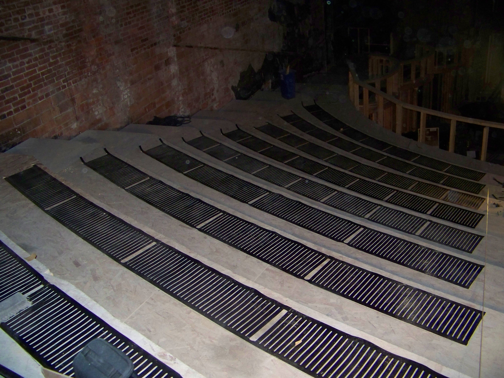
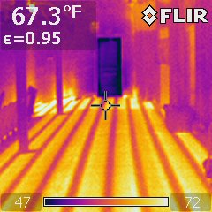
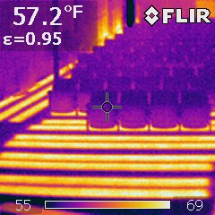

Heritage buildings present a peculiar set of comfort challenges. The architecture is the entire point. You can't add visible HVAC, you can't core through plaster ceilings, and you can't compromise sight lines from the seating with surface-mounted equipment. But you also can't keep selling tickets to patrons who arrive in a December evening dress and immediately regret their choices.

Working with one of America's historic opera houses, we had the chance to deliver something that's still one of our favorite case studies: a complete radiant installation, from the entrance lobby through the main auditorium and underneath the seating rows, that's both invisible and verifiable.

*The balcony zone: element runs fanned out beneath the under-seat radiant, with the venue's original brick masonry exposed above.*

## The "verifiable" part is the unusual one

Most radiant installations get verified the old-fashioned way: people stand on the floor, the floor feels warm, the project manager nods, the punch list closes. For this venue, we did something more rigorous. The commissioning team captured 106 FLIR thermal images across the heated zones, documenting actual surface temperature distribution against design intent.

The result was striking. Across the lobby floor, the auditorium aisles, and the under-seat radiant zones, surface temperatures were consistent within a 1-2°F band, meaning a patron walking from the box office to row M would feel essentially the same warmth underfoot the entire way. No cold spots at the perimeter, no hot spots near the registers, no zones where the design didn't quite match the result.

*FLIR commissioning shot, 67.3°F surface. The regular striped pattern is the self-regulating element layout reading clearly through the finish floor.*

*Even the lobby stair treads got their own under-step heating zone, captured here in thermal at 57.2°F before opening.*

> 106 thermal images. One narrow temperature band. Zero cold spots.

## What "from entrance to seating rows" actually means

The scope spanned the venue's full guest journey:

- **Entrance and lobby**, where patrons transition from outdoor cold to indoor formal-wear comfort
- **Auditorium aisles and orchestra-level floor**, where pre-show and intermission foot traffic peaks
- **Under-seat radiant**, where seated patrons experience the longest dwell time at the lowest activity level

The under-seat zones were the most technically interesting. Seated audiences generate very little body heat compared to standing or walking patrons, and they're sitting still for two-to-three-hour stretches. Conventional HVAC distributes warm air at head height, which helps the back of the neck but does nothing for the feet. Radiant solves this from the right direction.

## The heritage constraints

Heritage buildings make every decision harder. The radiant installation had to:

- Run within the existing floor buildup, with no raising the floor or compromising the sightlines
- Avoid penetrations into historically protected ceilings or walls
- Work with the venue's HVAC philosophy of conditioning the audience rather than the volume of air
- Tolerate the reality that some areas were going to be inaccessible for service

StableHeat's thin polymer elements made this work. The buildup was minor. There were no maintenance points that required pulling up the floor. And, most importantly, none of it was visible from the seating.

## What the project taught us about heritage work

A few things we'd recommend to anyone working on a historic venue:

- **Radiant pairs naturally with the conservation philosophy.** It's invisible, low-impact, and doesn't fight the building's existing thermal envelope.
- **Document with thermal imaging.** Heritage stakeholders need proof, not promises.
- **Underseat zones change the conversation.** Patrons stop noticing the room temperature because their feet are comfortable. The whole HVAC system can be tuned conservatively as a result.

The project completed in 2008. It's been running through every season since, without disruption to the venue's program. That, in heritage work, is the only review that matters.
