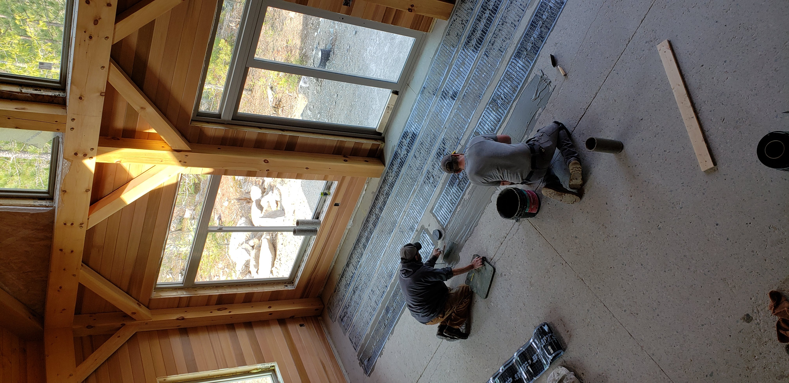

The Snowbank Lake project came to us in 2022 with a clear brief: build out a full-house radiant system across a lakefront residence in a part of the country where winters arrive early and stay late. The owner had lived in the house for several seasons. The view was what they bought it for. The cold was what they were trying to fix.

We documented the install in May 2022, across the great room, the bedrooms, the bathrooms, and the mechanical wall that holds it all together. The pictures tell the story better than any spec sheet, but the underlying story is about something specific: how a lakefront house in a snowy climate works *differently* with radiant.

*The great room mid-install. The element strips run perpendicular to the lake-facing window wall, where the cold-load is heaviest.*

## Why lakefront houses need this more than most

A house on a lake has more thermal exposure than a comparable inland house. The water acts as a heat sink in winter (surface temperatures stay cold long into spring), and the wind paths off the water amplify chill in any room with a lake-facing window wall. The very feature that makes the house desirable also makes it harder to keep warm.

Forced-air HVAC tries to compensate by running constantly through the lake-facing rooms. The result is dry air, blower noise, and a heating bill that arrives every February as a separate trauma.

Radiant takes this problem from a different direction. The floors carry the comfort load directly to the people in the room. The HVAC does less work. The house feels different at the same air temperature.

> The lake is what you bought the house for. It shouldn't also be what's making you cold.

## What the install actually looked like

The Snowbank Lake project covered the entire main living area, the bedrooms, and the bathrooms. Each room was its own zone with an independent thermostat. The element ran in parallel strips below an engineered wood finish floor, a combination that's now standard in our residential work but was still a thoughtful choice in 2022.

Key project decisions visible in the photo documentation:

- **Strip spacing tuned per room.** Higher density in the bathrooms and the lake-facing great room; standard density in interior rooms.
- **Engineered wood, not solid hardwood.** Dimensionally stable across the temperature swings a radiant system produces.
- **Zone control by use, not by floor.** The owner wanted the bedrooms to fall back overnight and the great room to stay constant, which is easier with per-room zoning.

*The mechanical wall. Each transformer and controller pair drives one zone, which is what makes the per-room thermostat layout possible.*

## What changed for the owner

The first winter was the proof season. The lake-facing great room (the one that used to be 4°F cooler than the rest of the house in January) now reads consistent with the bedrooms. The forced-air system runs less. The floor under the breakfast nook stays warm enough that the family stopped pulling the kitchen rug back in October.

For the owner, the success metric is simple: they stopped scheduling around the cold. The house works in February the same way it works in June.

That's the lakefront brief, met cleanly.
