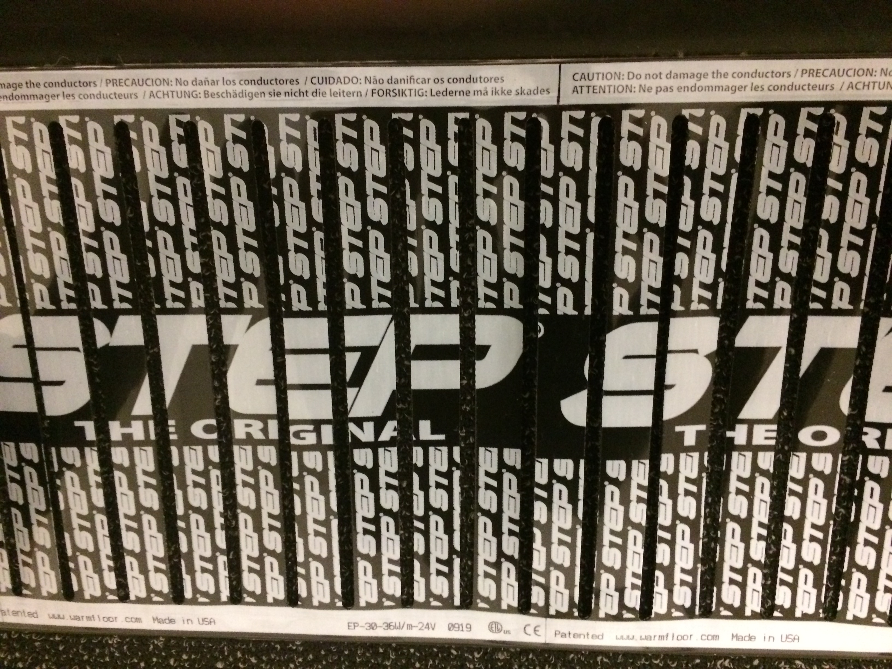

Most blog content focuses on the install. The element goes in, the deck goes down, the vessel goes to sea, and the photograph that gets shared is the finished space. That's the chapter the customer sees.

Our work with the Ulutas Group is a chance to show the chapters that come first: the part of an international marine sale that actually gets the product to the shipyard in receivable, installable condition. Conformity certification. Bench testing with documented results. SOLAS-rated packaging. A commercial invoice that satisfies customs at both ends. For a U.S. manufacturer selling marine heating into international shipyards, that documentation package is half the product.

## What ships before the hardware does

Every international marine shipment we send out is built around a documentation set, not just a crate of hardware. The package has five parts, all familiar to anyone who has worked international logistics in regulated electrical equipment:

- **CE Declarations of Conformity** for both the heating element and the low-voltage power supply, with manufacturer attestations referencing the applicable European standards.
- **EN-standard test reports** from independent benches: EN 60335-96 for the electric surface heating system, and EN 61558-2-2 for the safety transformer / power supply. Documented pass conditions, not marketing claims.
- **SOLAS-compliant packaging declarations** for ocean shipping. SOLAS is the International Maritime Convention that governs how cargo is documented and stowed for sea transport, and a shipment that can't satisfy it doesn't sail.
- **Commercial invoices** with line-item breakdowns, declared values, and country-of-origin attestations that satisfy customs at the receiving port.
- **Regulatory markings on the hardware itself**: cETLus listing for North America, CE for the EEA, RoHS, and multilingual hazard labels. The receiving inspector reads them on the panel, not in a manual.

*The element ships with its compliance built into the surface. Multilingual hazard text and the CE mark on the lower edge mean the receiving electrician reads the safety warnings in their own language without opening a binder.*

That's the full package: the documentation set, plus the hardware that's already labeled to clear inspection on arrival.

> A U.S. marine manufacturer selling internationally doesn't just ship product. We ship a documentation package that lets the receiving yard install with confidence on day one.

## Why this is competitive moat, not overhead

It would be easy to think of conformity certifications and SOLAS packaging declarations as administrative cost: the friction of doing business across borders. The reality is the opposite. The documentation is what makes the sale possible:

- **CE marking** is a legal requirement for selling electrical equipment into the European Economic Area. No CE, no sale.
- **EN-standard bench-test reports** are what the receiving yard's compliance team uses to satisfy their own inspectors. Without them, the yard has to do its own re-testing, which adds time and cost they didn't budget for.
- **SOLAS packaging declarations** prevent cargo refusals at the loading port. A shipment that can't satisfy the carrier's documentation requirements doesn't sail.
- **Commercial invoices with proper country-of-origin attestations** prevent customs holds at the receiving port. A shipment held in customs is a shipment that costs the receiving yard money every day it's held.

The manufacturers who can produce that documentation package quickly, cleanly, and consistently are the manufacturers that international yards prefer to buy from. The manufacturers who can't are the ones whose shipments get delayed, refused, or quietly dropped from the next bid list.

## What the Ulutas relationship represents

The Ulutas Group order is a working example of the documentation discipline we maintain on every international marine shipment. The conformity certifications, the bench tests, the packaging declarations: these aren't one-off project deliverables. They're the standard documentation set that ships with every international order, and they're the reason our international marine business keeps growing year over year.

The product is the heating element. The package is the paperwork that gets it across an ocean and into a yard ready to install.
